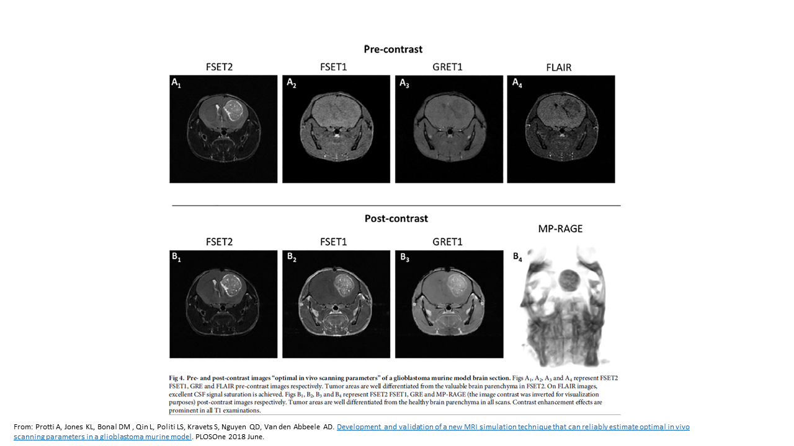

# Images from my career as an Imaging-Scientist

## Brain MRI of brain tumor model 
Glioblastoma (GBM) is a type of brain tumor that is classified as a grade IV astrocytoma, the most aggressive type of brain tumor. GBMs are characterized by their rapid growth and tendency to invade surrounding brain tissue. Here an MRI image of a GBM mouse model of in vivo study is reported. The image relates to several MRI sequences at 7T on the same model.
.

## Cardiac MRI of VSOP in infarcted heart 
A study was conducted to investigate the use of iron nanoparticle in an infarcted myocardium in the acute to chronic phase. Accumulation of the latter
was achieved in macrophges within the infarcted area as a sign of inflammation in the acute phase of the disease burden. Although macrophages continue to withhold the particle through time, the quantity of VSOP is reduce at late stage of infarction due perhaps to the removal of the macrophages initially accumulated.  

## Cardiac MRI of BMT mouse model
Acute myocardial infarction (MI) evokes an initial inflammatory response involving infiltration by neutrophils, In the course of a study investigating responses to acute MI in mice that had undergone Bone marrow transplantation (BMT) , we found that the process of BMT itself substantially alters the response of the heart to acute MI. Here, we report monocytes/macrophages and lymphocytes, that when acute MI is induced by permanent coronary ligation after BMT, there is a significantly enhanced cardiac contractile recovery and a reduction in adverse remodelling that is attributable to an altered tis-sue macrophage phenotype

.

## MRI and PET images acquired at the LFIC facility
.

